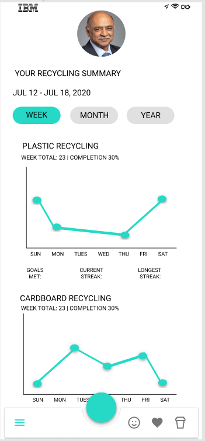

# Recycling App (IBM Hackathon)

### [See Demos](#mock-ups)
### [See Hackathon Presentation](demos/YouCycle.mp4)

### DESCRIPTION

- For the IBM North American Intern Hackathon, my team created an iOS app which encourages users to recycle by: 
  - tracking their recycling habits
  - showing their impact on the environment based on their recycling history
  - giving them easy access to local and general recycling instructions & restrictions
- This program sets up a database in SQLite with python code supplying an API to interface with the database.
 

### FILE INFO

- [**CreateDatabase.sql**](CreateDatabase.sql) initializes a SQLite database to be used by the app. The database includes:
  - a `Users` table, to store user information
  - a `Recycling` table, to store user recycling history
  - a `RecyclingInstructions` table, to store local recycling instructions

- [**PopulateDatabase.sql**](PopulateDatabase.sql) fills the database with preliminary values including:
  - 3 users (john.smith, jdoe200, brianj)
  - 9 recycled objects (5 from john.smith, 4 from brianj)
  - 2 local recycling instructions (Zip Codes: 95112 and 10022)
  - 4 test insertions (should fail) to check database constraint integrity
  
- [**database.db**](database.db) is a SQLite database created by [**CreateDatabase.sql**](CreateDatabase.sql) and populated by [**PopulateDatabase.sql**](PopulateDatabase.sql).

- [**YouCycleApi.py3**](YouCycleApi.py3) runs an API service on the local host to provide access to the database that a front end service can connect to.

### API FUNCTIONALITY
  
- The API has the functionality to: 
  - register users
  - login users
  - get user info
  - get local recycling instructions by user or location
  - record a user's recycling inputs
  - get a user's recycling history
  - get a user's calculated environmental impact

- For more information on the API, including the format of input and output JSONs, see [**YouCycle API.pdf**](YouCycle%20API.pdf)
 

### PROGRAM SETUP

- Download this repo.
- Make sure python3 and pip3 are installed on your machine.
- Make sure flask, flask_restful, and pandas are installed for python, e.g:
  > `$ pip3 install flask`  
  > `$ pip3 install flask-restful`  
  > `$ pip3 install pandas`
- Run [**YouCycleApi.py3**](YouCycleApi.py3)
  > `$ python3 YouCycleApi.py3`  
 

### MOCK-UPS

Home Screen                     | Personal Trends                 | Social Leaderboard                 | Location Selection 
:------------------------------:|:-------------------------------:|:----------------------------------:|:-----------------------------------:
      |   |   | 

 

### DEMOS

Login                           | Tabs
:------------------------------:|:-------------------------------:
            | 
**ENDPOINTS USED**              | **ENDPOINTS USED**
`/youcycle/login`               | `/youcycle/user/instructions`   `/youcycle/user`   `/youcycle/impact`
